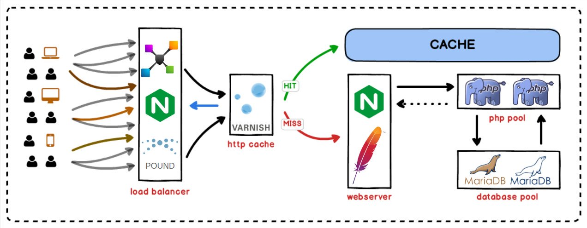

<p align=center>
    <a href="https://bit.ly/ctteg"></a>
    <a href="https://bit.ly/cttfo"></a>
    <a href="https://contributte.org/partners.html"></a>
</p>

<p align=center>
    Website 🚀 <a href="https://contributte.org">contributte.org</a> | Contact 👨🏻‍💻 <a href="https://f3l1x.io">f3l1x.io</a> | Twitter 🐦 <a href="https://twitter.com/contributte">@contributte</a>
</p>

## Disclaimer

| :warning: | This project is no longer being maintained. Please use [contributte/dockerfiles](https://github.com/contributte/dockerfiles).
|---| --- |
| GitHub| [`https://github.com/contributte/dockerfiles`](https://github.com/contributte/dockerfiles) |

## Documentation



### Install

#### Manually

1. Download startup script
2. Download or create `docker-compose.yml`

#### Automatic

```bash
wget -O https://raw.githubusercontent.com/componette/dockerfiles/master/componette-installer | bash
```

### Containers

All containers are pretty standalone. You can just download a `docker-compose.yml` and start it.

#### Database

Update credentials in `docker-compose.yml`.

Defaults:
- user: root/dockerroot
- user: docker/docker
- database: docker

## Development

This package was maintain by these authors.

<a href="https://github.com/f3l1x">
  
</a>

-----

Consider to [support](https://contributte.org/partners.html) **contributte** development team.
Also thank you for being used this package.
